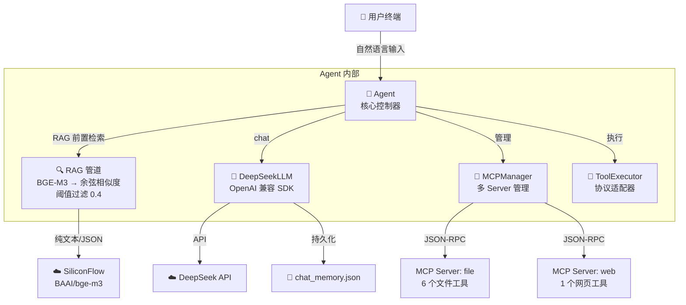

# 🤖 Augmented LLM — Chat + MCP + RAG

> **从零构建的增强型 LLM Agent 应用** — 不依赖 LangChain、LlamaIndex 等框架，深入理解 LLM Agent 底层工作原理。

[](https://www.python.org/)
[](https://platform.deepseek.com/)
[](https://modelcontextprotocol.io/)
[]()

---

## 🚀 快速开始

```bash
# 1. 克隆项目
git clone <your-repo-url>
cd LLM-RAG-MCP

# 2. 创建虚拟环境
python -m venv .venv
.venv\Scripts\Activate.ps1   # Windows
# source .venv/bin/activate   # macOS/Linux

# 3. 安装依赖
pip install -r requirements.txt

# 4. 配置 API Key
cp .env.example .env
# 编辑 .env，填入你的 DeepSeek API Key 和 SiliconFlow API Key

# 5. 启动
python main.py
# 或双击 start.bat
```

启动时自动加载 `data/` 下的 Demo 数据，无需手动操作。

---

## ⚙️ 配置说明

### .env — API Key（gitignore 保护）

```bash
DEEPSEEK_API_KEY=sk-xxx
SILICONFLOW_API_KEY=sk-xxx
```

### config.yaml — 系统配置（已提交）

```yaml
llm:
  model: "deepseek-chat"
  base_url: "https://api.deepseek.com"
  max_tokens: 4096
  temperature: 0.7

embedding:
  model: "BAAI/bge-m3"
  base_url: "https://api.siliconflow.cn/v1"
  top_k: 3

mcp_servers:
  - name: "file"
    command: ".venv/Scripts/python.exe"
    args: ["mcp_servers/file_tools.py"]

  - name: "web"
    command: ".venv/Scripts/python.exe"
    args: ["mcp_servers/web_tools.py"]

system:
  max_tool_rounds: 10
  memory_file: "chat_memory.json"
```

API Key 从 `.env` 环境变量读取，`config.yaml` 中的 `api_key` 字段作为 fallback 占位符。

---

## 📁 项目结构

```
LLM-RAG-MCP/
├── main.py                     # 终端交互入口
├── start.bat                   # Windows 一键启动
├── config.yaml                 # 系统配置
├── .env.example                # API Key 模板
├── requirements.txt            # 4 个轻量依赖
├── .gitignore
├── README.md
│
├── src/                        # 核心源码
│   ├── agent.py                # Agent 核心控制器
│   │                           #   启动自动加载 + 去重 + 阈值过滤
│   ├── llm.py                  # DeepSeek LLM 封装 (OpenAI SDK)
│   ├── mcp_client.py           # 单个 MCP Server 连接
│   │                           #   JSON-RPC over stdio + Future 异步匹配
│   ├── mcp_manager.py          # 多 MCP Server 管理 + 工具聚合 + 格式转换
│   ├── tool_executor.py        # 工具执行器 + 协议适配
│   ├── rag.py                  # RAG：VectorStore + EmbeddingRetriever
│   │                           #   BGE-M3 + 余弦相似度
│   ├── config.py               # YAML 加载 + .env 解析
│   ├── logger.py               # 彩色日志横幅系统
│   └── types.py                # 数据类型定义
│
├── mcp_servers/                # MCP Server 实现
│   ├── file_tools.py           # 6 个文件操作工具
│   │                           #   read / write / delete_file
│   │                           #   delete_directory / list / find
│   └── web_tools.py            # 1 个网页抓取工具
│                               #   web_fetch_summary
│
├── data/                       # Demo 数据（已提交）
│   ├── employees.json          # 50 名员工（文件科技）
│   └── docs/                   # 6 份内部文档 (.md)
│
└── screenshots/                # 功能截图
```

---

## 🏗 架构概览



### 数据流

```
用户输入 → RAG 前置检索（强制接地）
    │
    ▼
BGE-M3 向量化 → 余弦相似度 × N 条数据 → top_k 排序
    │
    ├─ best_score < 0.4 → 跳过上下文注入（避免无关信息干扰）
    │
    └─ best_score ≥ 0.4 → 原始文本直传 LLM（不拆字段）
    │
    ▼
prompt + tools → DeepSeek
    │
    ├─ 直接回答 → 返回文本
    └─ 调工具 → tool_calls → 执行 → 结果注入 → 再判断
```

---

## 🧠 核心机制

### Tool-Use 工具调用

**7 个可用工具：**

| 工具 | 功能 | 安全 | 所属 Server |
|------|------|------|------------|
| `read_file` | 读取本地文件 | — | file |
| `write_file` | 新建 / 覆写文件 | 路径白名单 | file |
| `delete_file` | 删除文件 | 路径白名单 | file |
| `delete_directory` | 递归删除目录 | 路径白名单 | file |
| `list_directory` | 列出当前层目录内容 | — | file |
| `find_files` | 递归搜索文件（支持通配符） | — | file |
| `web_fetch_summary` | 抓取网页 → 摘要 → 保存 | — | web |

LLM 自主决定调用哪个工具、填什么参数。代码不做 if-else 或正则匹配。

```text
👤 你: 帮我找一下 agent.py 在哪，读一下，然后把它的功能总结写到 AGENT_SUMMARY.md

=== TOOL USE: find_files("agent.py") ===
  → 找到 src/agent.py
=== TOOL USE: read_file("src/agent.py") ===
  → 读入全文
=== TOOL USE: write_file("AGENT_SUMMARY.md", "Agent 核心控制器...") ===
  → 写入完成

🤖 助手: 已完成。agent.py 的功能总结已保存到 AGENT_SUMMARY.md。
```

### RAG 检索增强生成

**设计原则：Pre-Retrieval（强制接地）** — 每次对话先用 BGE-M3 检索相关数据，LLM 必须基于上下文回答，防止幻觉。

**数据加载：** 启动时自动加载 `data/employees.json`（JSON）和 `data/docs/`（Markdown 纯文本），共享同一个向量库。

**关键特性：**
- **阈值过滤**：最高相似度 < 0.4 时跳过上下文注入，避免无关数据干扰 LLM
- **通用上下文**：检索结果原样传给 LLM，不做字段拆解——JSON 和 Markdown 都能正确理解
- **启动自动加载**：`init()` 自动加载数据，无需手动命令
- **去重机制**：用文件绝对路径做 key，重复加载自动跳过
- **不产生运行时文件**：检索结果直接注入对话，不写磁盘

```text
👤 你: GPU采购审批状态？

=== RAG ===
  top_3 results:
  #1 score=0.7729 — GPU采购审批：A10×4 已提交IT采购部门，待叶美玲审批...
  #2 score=0.4099 — {"name":"陈志远","company":{"name":"研发部"}...}
  #3 score=0.3306 — 考勤与休假管理制度：弹性工作制...

🤖 助手: GPU A10×4 采购已提交IT采购部门，目前待叶美玲审批。
          风险：供应紧张可能导致延期2-4周。
          推动人：陈志远(技术总监) + 孙伟杰(AI服务负责人)。
```

### 长期记忆

对话历史自动保存为 `chat_memory.json`，关闭终端后下次启动自动恢复。

```text
第一次启动 → 聊天 → exit
  [INFO] Memory saved: chat_memory.json (5 msgs)

第二次启动:
  [INFO] Memory restored: chat_memory.json (5 msgs)
  👤 你: 我之前说我叫什么？
  🤖 助手: 你之前说你叫小明。 ✅
```

---

## 🎯 设计决策

| 决策 | 选择 | 理由 |
|------|------|------|
| RAG 触发时机 | Pre-Retrieval（前置检索） | 强制接地，LLM 每次回答都有数据依据 |
| 上下文传递 | 原始文本直传 | LLM 读 JSON/Markdown 能力 > 代码拆字段翻译 |
| 员工数据格式 | JSON | 字段名参与语义向量化，信息密度高 |
| 文档数据格式 | 纯文本 Markdown | 零中间层，原文直入无信息损耗 |
| 向量库叠加 | 追加不清空 | 多数据源共存，`/clear` 统一清理 |
| 路径安全 | `resolve()` + 前缀白名单 | 先展平再比对，防 `../` 穿越 |
| MCP 传输 | JSON-RPC over stdio | 子进程通信，无需网络端口 |
| API Key 管理 | `.env` 环境变量 | 提交安全 + 零依赖 |

---

## 📋 终端命令

| 命令 | 功能 |
|------|------|
| 输入消息 | 发送给 LLM（Chat / Tool-Use / RAG） |
| `/clear` | 清空对话历史 + 记忆 + 向量库 |
| `exit` / `quit` | 保存记忆并退出 |

---

## 📊 日志横幅

| 横幅 | 含义 |
|------|------|
| `=== MCP CONNECT ===` | MCP Server 连接与握手 |
| `=== TOOLS ===` | 启动时列出所有可用工具 |
| `=== RAG ===` | RAG 检索阶段（embedding → 相似度 → top_k） |
| `=== CHAT ===` | 消息发送给 LLM |
| `=== RESPONSE ===` | LLM 返回（文本 或 tool_calls） |
| `=== TOOL USE ===` | 执行 LLM 要求的工具调用 |
| `=== TOOL RESULT ===` | 工具结果注入回对话 |

---

## 🔌 MCP Server 扩展

添加新 MCP Server 只需在 `config.yaml` 中加一项：

```yaml
mcp_servers:
  - name: "file"
    command: ".venv/Scripts/python.exe"
    args: ["mcp_servers/file_tools.py"]

  - name: "web"
    command: ".venv/Scripts/python.exe"
    args: ["mcp_servers/web_tools.py"]

  # 数据库
  - name: "mysql"
    command: ".venv/Scripts/python.exe"
    args: ["mcp_servers/mysql_server.py"]
```

所有 Server 的工具自动聚合，LLM 统一调用。

---

## 🚧 未来扩展方向

| 扩展 | 方式 |
|------|------|
| MySQL 员工数据 | 加 SQL MCP Server → 查询结果转 JSON → RAG |
| PDF/Word 文档 | 加文档解析 MCP Server → 纯文本 → RAG |
| 流式输出 | `llm.chat(stream=True)` |
| Web 界面 | FastAPI + 前端 |
| 多用户 | 会话隔离 + 用户权限 ACL |
| Skill 系统 | 工具按能力分组，LLM 先选 Skill 再选工具 |

---

## ✨ 核心特性

- **零框架依赖** — 只用 4 个库：`openai` / `mcp` / `pyyaml` / `httpx`
- **7 个文件工具** — 完整 CRUD + 递归搜索 + 递归删目录 + 网页抓取，路径白名单
- **Pre-Retrieval RAG** — BGE-M3 强制接地 + 阈值过滤 + 通用上下文 + 零运行时文件
- **多 MCP Server** — JSON-RPC over stdio，file + web 独立子进程，工具自动聚合
- **Tool-Use 循环** — LLM 自主决策 → 执行 → 结果注入 → 继续推理
- **长期记忆** — 对话持久化，关闭终端后恢复
- **启动即用** — 自动加载数据 + 去重保护 + 一键 start.bat
- **安全** — API Key 环境变量隔离，写/删操作限制在工作目录内
